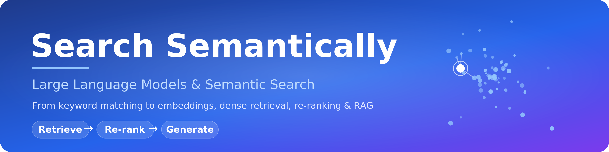

<p align="center">
  
</p>

# Search Semantically — Large Language Models & Semantic Search

> A modular, beginner-to-expert open-source course on how modern search works: from
> classic keyword matching to embeddings, dense retrieval, re-ranking, evaluation,
> and Retrieval-Augmented Generation (RAG).

This repository is a **self-contained study companion** for learning how Large
Language Models (LLMs) transform information search. Every chapter pairs **intuitive
explanations** (analogies, diagrams, worked examples) with **runnable code and
notebooks** so you can learn the idea *and* build it.

It is inspired by the ideas in the DeepLearning.AI × Cohere short course
*"Large Language Models with Semantic Search"*, but **all explanations, examples,
diagrams, and code here are original** and written to stand on their own. We use an
**open-source-first** toolkit (no paid API keys required) so anyone can run everything
locally.

<p align="center">
  
  
  
  
  
  
  
  
</p>

📘 **[Download the e-book (PDF) →](Search-Semantically-ebook.pdf)** — all 14 chapters in one
colorful, ebook-formatted document (~69 pages) with a designed cover, table of contents,
callouts, typeset math, and an answers appendix. Perfect for reading offline or sharing.
(Rebuild it any time with [`ebook/build.sh`](ebook/build.sh).) Every page carries a footer and a light **watermark** with the author's name, and the PDF embeds author metadata.

> ⭐ **If this course helps you, please [star the repo](https://github.com/mdhabibi/llm-search-handbook)** — it helps others discover it and motivates new chapters.

---

## Who this is for

- **Beginners** — you know a little Python and want to understand how search engines
  and AI assistants actually find relevant information. Start at Chapter 0 and read in
  order.
- **Intermediate developers** — you want to build a real semantic search or RAG system.
  Skim the foundations, then dig into Chapters 5–11.
- **Experts** — each chapter ends with a *Going Deeper* section covering math,
  trade-offs, papers, and production concerns.

Difficulty is marked throughout:

| Badge | Meaning |
|-------|---------|
| 🟢 | Core idea — everyone should read |
| 🟡 | Intermediate — assumes the core idea |
| 🔴 | Advanced / optional deep dive |

---

## What you will be able to do by the end

1. Explain how search worked **before** LLMs (keyword / lexical search) and why it falls short.
2. Turn text into numbers with **embeddings** and reason about vector space.
3. Build a **semantic (dense retrieval)** search engine from scratch.
4. Scale it with a **vector database** and approximate nearest-neighbor indexes.
5. Sharpen results with **re-ranking** and **hybrid search**.
6. **Evaluate** a search system properly (precision, recall, MRR, nDCG).
7. Plug retrieval into an LLM to build a grounded **RAG** question-answering app.
8. Ship a **capstone** project end to end.

---

## How the repo is organized

```
Search Semantically/
├── README.md                       ← you are here
├── ROADMAP.md                      ← the full curriculum & learning path
├── GLOSSARY.md                     ← every key term, defined simply
├── Search-Semantically-ebook.pdf   ← the whole course as a colorful e-book
├── ebook/                          ← scripts to rebuild the PDF from the chapters
├── slides/                         ← presentation decks per chapter (PPTX/PDF + Gamma/NotebookLM)
├── setup/SETUP.md                  ← environment setup (one-time)
├── requirements.txt                ← Python dependencies
├── data/                           ← sample corpus + labeled eval set
├── src/                            ← reusable modules (corpus, semantic_search,
│                                     metrics, chunking, search_stack)
└── chapters/
    ├── 00-introduction/
    ├── 01-foundations-of-information-retrieval/
    ├── 02-keyword-lexical-search/
    ├── 03-text-to-vectors/
    ├── 04-embeddings-deep-dive/
    ├── 05-dense-retrieval-semantic-search/
    ├── 06-vector-databases-and-ann/
    ├── 07-reranking/
    ├── 08-hybrid-search/
    ├── 09-evaluating-search/
    ├── 10-rag-retrieval-augmented-generation/
    ├── 11-chunking-and-production-pipelines/
    ├── 12-advanced-topics/
    └── 13-capstone-project/
```

Every chapter folder follows the **same modular layout**:

```
NN-chapter-name/
├── README.md      ← the lesson: concepts, intuition, diagrams, worked examples
├── notebooks/     ← hands-on Jupyter notebooks you run yourself
└── assets/        ← chapter-specific images and diagrams
```

---

## Quick start

```bash
# 1. Clone and enter the repo
git clone <your-repo-url> && cd "Search Semantically"

# 2. Create an environment and install dependencies
python -m venv .venv && source .venv/bin/activate   # Windows: .venv\Scripts\activate
pip install -r requirements.txt

# 3. Launch the notebooks
jupyter lab
```

**Prefer zero setup?** Every chapter notebook has an **Open in Colab** badge at the top — click it to run
the lesson in your browser, no install required.

Full details (including troubleshooting and optional GPU notes) are in
[`setup/SETUP.md`](setup/SETUP.md).

---

## The learning path at a glance

| # | Chapter | You will learn |
|---|---------|----------------|
| 0 | [Introduction](chapters/00-introduction/) | What semantic search is and how to use this repo |
| 1 | [Foundations of Information Retrieval](chapters/01-foundations-of-information-retrieval/) | The search problem before LLMs |
| 2 | [Keyword / Lexical Search](chapters/02-keyword-lexical-search/) | TF-IDF, BM25, the inverted index |
| 3 | [From Text to Vectors](chapters/03-text-to-vectors/) | Tokens, one-hot, bag-of-words → vectors |
| 4 | [Embeddings Deep Dive](chapters/04-embeddings-deep-dive/) | Word, sentence & document embeddings |
| 5 | [Dense Retrieval & Semantic Search](chapters/05-dense-retrieval-semantic-search/) | Search by meaning |
| 6 | [Vector Databases & ANN](chapters/06-vector-databases-and-ann/) | Scaling to millions of vectors |
| 7 | [Re-ranking](chapters/07-reranking/) | Cross-encoders to reorder results |
| 8 | [Hybrid Search](chapters/08-hybrid-search/) | Combining keyword + semantic |
| 9 | [Evaluating Search](chapters/09-evaluating-search/) | Precision, recall, MRR, nDCG |
| 10 | [RAG](chapters/10-rag-retrieval-augmented-generation/) | Grounded answers from an LLM |
| 11 | [Chunking & Production Pipelines](chapters/11-chunking-and-production-pipelines/) | Building it for real |
| 12 | [Advanced Topics](chapters/12-advanced-topics/) | ColBERT, multimodal, agentic RAG |
| 13 | [Capstone Project](chapters/13-capstone-project/) | Build a full system |

See [`ROADMAP.md`](ROADMAP.md) for the detailed outline of every chapter.

---

## Status

**All 14 chapters are complete** 🟩 — every chapter has a full written lesson (intuition,
diagrams, worked examples) and a runnable notebook with our own code and data. Shared,
reusable modules live in `src/`:

- `corpus.py` — sample corpus loader + tokenizer
- `semantic_search.py` — a minimal dense-retrieval engine (Ch 5)
- `metrics.py` — precision/recall/MRR/nDCG/MAP from scratch (Ch 9)
- `chunking.py` — fixed-size & sentence chunkers (Ch 11)
- `search_stack.py` — the full capstone stack: hybrid retrieve → re-rank → RAG → evaluate (Ch 13)

Every notebook's logic was verified; steps needing a model download (embeddings,
cross-encoder, LLM) run on your machine, while the offline logic is tested end to end.

---

## Poster

A one-page visual map of the whole course lives at
[`assets/poster.png`](assets/poster.png) — handy for sharing or printing.

---

## Versioning

This project follows [Semantic Versioning](https://semver.org). The current release is
**v1.0.0** (see [`CHANGELOG.md`](CHANGELOG.md) and [`VERSION`](VERSION)).

---

## Contributing

Contributions that make the course clearer, more correct, or more complete are welcome —
see [`CONTRIBUTING.md`](CONTRIBUTING.md) and our [`CODE_OF_CONDUCT.md`](CODE_OF_CONDUCT.md).

---

## Citation

If you use this course, please cite it (metadata in [`CITATION.cff`](CITATION.cff)):

> Habibi, M. (Dr.) (2026). *Search Semantically — Large Language Models & Semantic Search* (v1.0.0).
> https://github.com/mdhabibi/llm-search-handbook

---

## E-book attribution & protection

The e-book is authored by **Dr. Mahdi Habibi**. To keep attribution with the file:

- every page shows a footer (`© 2026 Dr. Mahdi Habibi · Search Semantically · v1.0.0`) and a faint diagonal watermark;
- the PDF embeds author/title metadata (visible in any reader's document properties);
- an optional [`ebook/protect.sh`](ebook/protect.sh) produces a distribution copy (via `qpdf`) that opens freely but disables copying and editing.

> No PDF protection is unbreakable, but these measures ensure any shared copy is clearly attributed to the author.

---

## License & attribution

This project is **dual-licensed**:

- **Code** (source files, notebooks, scripts) — [MIT License](LICENSE).
- **Content** (chapter text, diagrams, glossary, the e-book) — [CC BY 4.0](CONTENT-LICENSE.md).

All explanations, examples, diagrams, and code are original. The course is inspired by — not
copied from — the DeepLearning.AI × Cohere short course *"Large Language Models with Semantic
Search"*. External papers and tools are credited in each chapter's *References* section.
