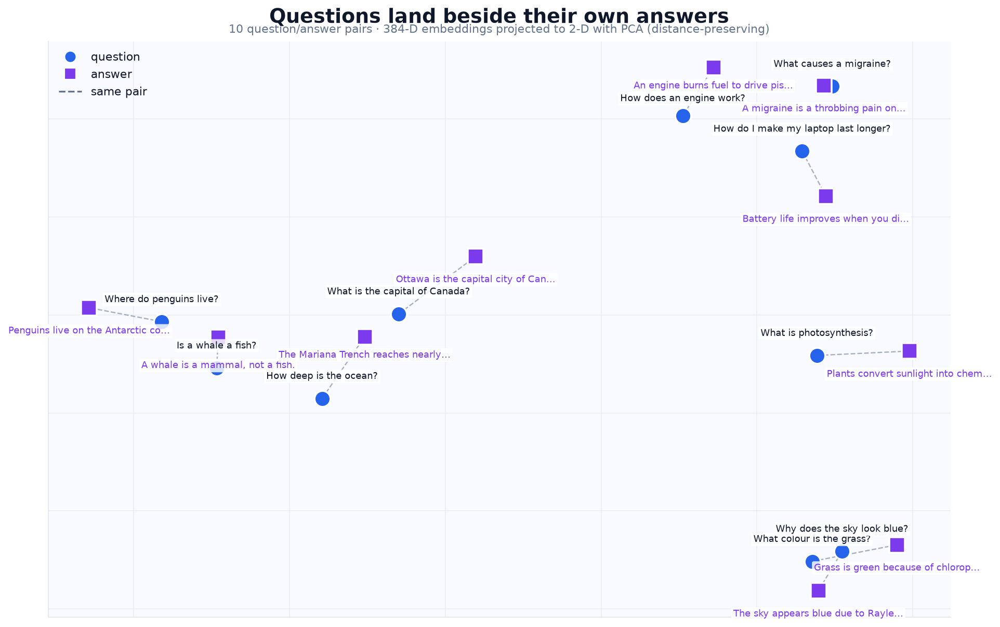
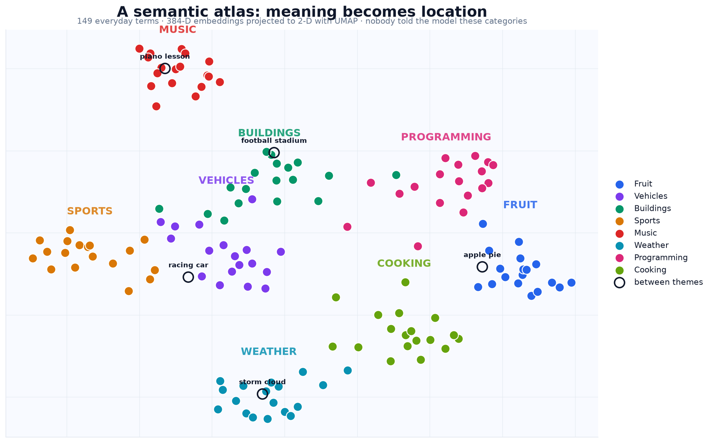
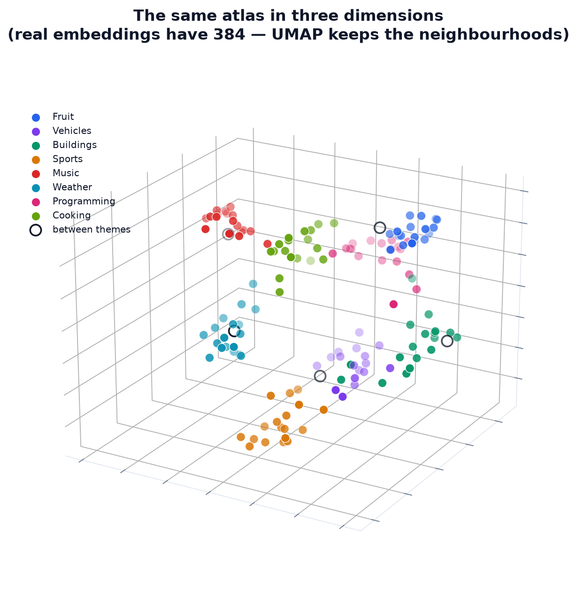
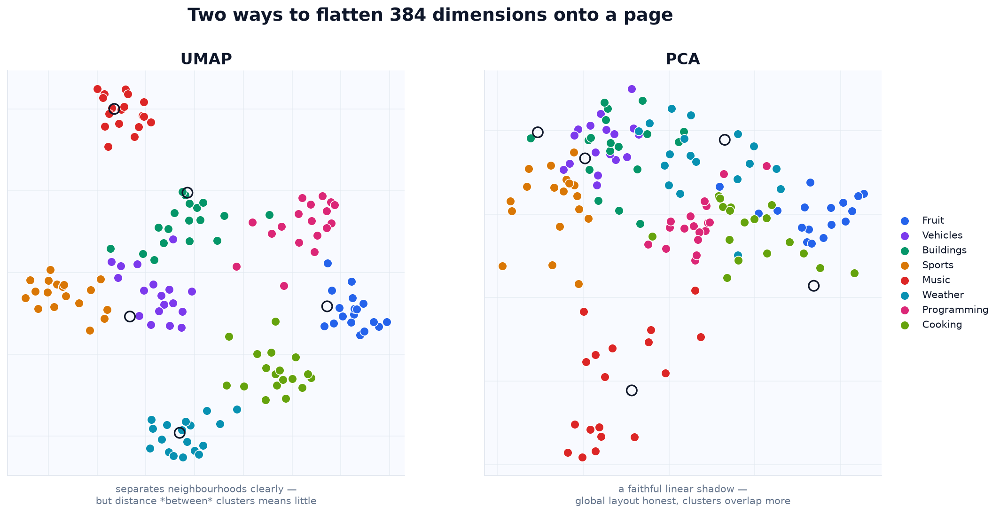

# Chapter 4 — Embeddings Deep Dive

> **Level:** 🟢 Beginner → 🟡 Intermediate  ·  **Status:** 🟩 Complete
> **Prerequisites:** Chapter 3 (vectors & cosine similarity).
> **You'll build:** hands-on intuition for real embedding models, and the exact demo that makes
> semantic search "click."

---

## At a glance

Chapter 3 argued that if we could place text in a space where *meaning = location*, search
would work by meaning. This chapter is where that becomes real. An **embedding model** is a
neural network trained to do exactly that: feed it text, get back a dense vector whose
neighbors are semantically similar. We'll use an open-source model, embed our own sentences,
and reproduce the striking result from the lesson — **every question's nearest neighbor is its
own answer.** That single observation *is* the seed of dense retrieval (Chapter 5).

---

## The motivation

We keep hitting the same wall: *temple* should be near *side of the head*, but keyword and
bag-of-words methods can't see it. An embedding model learns this from massive amounts of text.
By the end of this chapter, "how do I stop my laptop dying" will sit near "improving battery
life" in vector space — no shared words required.

---

## What is an embedding model, really?

An **embedding model** maps a piece of text to a fixed-length dense vector (its **embedding**).
It's trained so that texts humans consider similar get vectors that are close (high cosine
similarity), and dissimilar texts get vectors that are far apart.

```
   "an apple is a fruit"  ──▶ [ 0.02, -0.11, 0.34, ... ]   (e.g. 384 numbers)
   "a banana is a fruit"  ──▶ [ 0.03, -0.09, 0.31, ... ]   ← close to the apple vector
   "a car has four wheels"──▶ [-0.21,  0.40, 0.05, ... ]   ← far from both
```

You don't design the numbers; the model learned them. No single dimension means "fruitiness" —
meaning is spread across all of them.

---

## Three granularities: word, sentence, document

Embeddings exist at different scales, and the course cares mostly about the middle one:

| Level | What it represents | Typical use |
|-------|--------------------|-------------|
| **Word** | one word's meaning | word analogies, classic NLP |
| **Sentence / passage** | the meaning of a whole sentence or paragraph | **semantic search, RAG** ← our focus |
| **Document** | a long text's overall meaning | clustering, topic maps |

We use **sentence/passage embeddings** because search matches queries against passages.

---

## A short history (so the names make sense)

- **word2vec / GloVe (2013–2014)** — learn *one fixed vector per word*. Famous for vector
  arithmetic: `king − man + woman ≈ queen`. Limitation: "bank" (river) and "bank" (money) get
  the *same* vector, since there's no context.
- **Contextual embeddings — BERT (2018)** — the vector for a word now *depends on the sentence*
  around it, so the two "banks" differ. But BERT out of the box isn't tuned for comparing whole
  sentences by cosine similarity.
- **Sentence embeddings — Sentence-BERT / `sentence-transformers` (2019+)** — fine-tuned so a
  single vector per sentence is directly comparable with cosine similarity. This is what we use,
  and what powers modern semantic search.

---

## The model we use

We use **`all-MiniLM-L6-v2`** from the open-source `sentence-transformers` library:

- Free, small (~90 MB), runs on CPU, no API key.
- Outputs **384-dimensional** vectors.
- Fast enough to embed thousands of passages in seconds.

```python
from sentence_transformers import SentenceTransformer
model = SentenceTransformer("all-MiniLM-L6-v2")
vecs = model.encode(["an apple is a fruit", "a banana is a fruit"])
# vecs.shape -> (2, 384)
```

> Different models output different dimensionalities (384, 768, 1536, …). Bigger isn't always
> better — it's a trade-off of quality vs. speed vs. memory, which we revisit in Chapters 6 & 9.

---

## The "aha" demo: questions find their answers

This is the heart of the lesson. Take question/answer pairs, embed *all* of them, and for each
**question** find its nearest neighbor among the *other* sentences. The nearest one is its own
**answer** — even though question and answer share few words.

```
Q: "what color is the sky?"     → nearest: "the sky is blue."
Q: "what is an apple?"          → nearest: "an apple is a fruit."
Q: "where does the bear live?"  → nearest: "the bear lives in the woods."
```

Sit with this: matching *meaning* just turned a pile of sentences into a working question-
answering lookup. **Searching for the nearest embedding to a query = searching by meaning.**
That's dense retrieval, and Chapter 5 scales it to a real corpus.

### Seeing it

Here are ten of our own question/answer pairs, embedded and flattened onto a page. Each dashed
line joins a question to *its* answer:



Every question sits a short hop from its own answer — even though "Why does the sky look blue?"
and "The sky appears blue due to Rayleigh scattering" share almost no words. That short hop
*is* the retrieval step.

> This particular map uses **PCA**, not UMAP, on purpose: the claim here is about *distance*
> ("the answer is the nearest point"), and PCA preserves distances. More on that below.

---

## What the space looks like from above

One pile of sentences is convincing. A whole vocabulary is where it becomes obvious. Below are
~150 everyday terms across eight themes — fruit, vehicles, buildings, sports, music, weather,
programming, cooking — embedded and projected down to two dimensions:



**Nobody told the model these eight categories exist.** It never saw a label. The grouping comes
entirely from how these words get used in language — and that is the whole idea in one picture:
**meaning becomes location.**

Now look at the hollow points — terms we added deliberately because they belong to two themes at
once. *"racing car"* lands out on the frontier between Vehicles and Sports. *"apple pie"* sits on
the edge of Fruit, pulled toward Cooking. *"football stadium"* joins Buildings rather than Sports —
the model decided the noun mattered more than the modifier, which is a judgement you can argue
with, and that's exactly the point: these positions are *learned*, not defined.

The space has no walls. Things that are partly two things land partly in both places, and a term
can sit anywhere on the continuum. Keyword search has no equivalent move — a word is either
present or absent, and "apple pie" is simply two tokens with no location at all.

Two dimensions is a brutal squeeze of 384. A third axis unfolds clusters that 2-D forces on top
of one another:



And remember: even this is a shadow. The real space has **384 axes**, none of which means
anything on its own — there is no "fruitiness" dimension. Meaning is smeared across all of them.

### Honesty about the pictures

The maps above use **UMAP**, which preserves each point's *neighbourhood*. Its cousin **PCA** is
a straight linear shadow. Same vectors, both methods:



UMAP gives you cleaner islands; PCA gives you a more faithful global layout. The trap is reading
**the gaps between UMAP clusters as meaning**. UMAP stretches and squashes global distances
freely, so two far-apart clusters may be no more unrelated than two touching ones.

> **Projections are for looking, not for deciding.** Search always runs on the full
> 384-dimensional vectors. Nothing in a retrieval pipeline should ever be computed from a 2-D
> picture — the picture exists to build your intuition, then you throw it away.

---

## Properties worth knowing

- **Dimensionality** — fixed per model (384 for ours). Every text, short or long, becomes the
  same size vector.
- **Normalization** — many workflows L2-normalize embeddings so cosine similarity = dot product
  (faster, and what most vector databases expect).
- **Semantic arithmetic** — with *word* vectors, `king − man + woman ≈ queen`; a fun way to see
  that directions in the space carry meaning. (Sentence vectors don't do arithmetic as cleanly,
  but neighborhoods are very meaningful.)

---

## Hands-on

Notebook: [`notebooks/04_embeddings.ipynb`](notebooks/04_embeddings.ipynb)

You will:

1. Load `all-MiniLM-L6-v2` and embed a few sentences; inspect the shape (384) and a slice of
   the numbers.
2. Confirm that paraphrases ("hello, how are you?" vs "hi, how's it going?") get high cosine
   similarity while unrelated sentences don't.
3. Run the **question→answer nearest-neighbor demo** on our own Q/A pairs.
4. Embed our [course corpus](../../data/sample_corpus.json), find nearest neighbors for a
   query, and confirm the *migraine* passage that keyword search missed (Chapter 2) is now the
   top hit.
5. **Cluster** the corpus by meaning and **project to 2-D** (PCA) to see topics group together.
6. Build the **semantic atlas** above from our own eight-theme vocabulary, and plot it in **2-D
   and 3-D with UMAP** — then compare UMAP against PCA on identical vectors to understand what
   each projection preserves and what it distorts.

Then make it yours: add a theme of your own, drop in ambiguous terms and watch where they land
between clusters, and tune UMAP's `n_neighbors` to see the map change shape.

> Note: this notebook downloads a small model on first run, so it needs internet the first time
> (it then works offline). The pure-analysis helpers (cosine matrix, nearest neighbors,
> clustering, PCA) are written so they're easy to test even without the model.
>
> **UMAP is optional.** `pip install umap-learn` for the full effect; without it the notebook
> automatically falls back to PCA and still runs end to end.

---

## Slides

📊 **[Chapter 4 slide deck (PDF)](../../slides/Chapter-04-Embeddings-Deep-Dive.pdf)** — a visual
summary of embeddings and vector space.

---

## Going deeper 🔴

- **How are these models trained?** Mostly *contrastive learning*: pull known-similar pairs
  (e.g., a question and its answer, or a sentence and its paraphrase) together and push random
  pairs apart. The Q→A demo works because the model was trained on exactly this kind of signal.
- **Bi-encoder vs. cross-encoder.** The model here is a **bi-encoder**: it embeds each text
  independently, so vectors can be precomputed and reused — essential for fast search
  (Chapter 5). Cross-encoders (Chapter 7) are more accurate but can't precompute.
- **Symmetric vs. asymmetric search.** Some models are tuned for query↔document (asymmetric,
  e.g. "msmarco" models) vs. sentence↔sentence (symmetric). Picking the right one matters.
- **Pooling.** A sentence embedding is usually a pooled summary (mean of token vectors) from a
  transformer; different pooling changes the vectors.

---

## Pitfalls & gotchas

- **Different model = different space.** You cannot compare vectors from two different models.
  Embed the corpus and the query with the *same* model.
- **Forgetting to re-embed after a model change.** Swap the model → you must rebuild the whole
  index.
- **Ignoring the model's max input length.** Long passages get truncated; that's a big reason we
  *chunk* documents (Chapter 11).
- **Assuming bigger dimensions are always better.** They cost memory and speed; measure
  (Chapter 9) before paying for them.

---

## Key terms

embedding, embedding model, dense vector, dimensionality, word2vec, GloVe, contextual
embeddings, sentence embeddings, bi-encoder, normalization, contrastive learning, pooling.
*(See [GLOSSARY](../../GLOSSARY.md).)*

---

## Check your understanding

1. In one sentence, what is an embedding model trained to do?
2. Why does the word "bank" get one vector in word2vec but different vectors in BERT?
3. Why can a bi-encoder's document vectors be precomputed, and why does that matter for search?
4. Explain *why* a question's nearest embedding tends to be its own answer.
5. You switch from a 384-dim model to a 768-dim one. What must you redo, and why?

---

<!-- cyu-answers:start -->

> 💡 *Try answering each question yourself first, then expand to check.*

<details>
<summary><b>Show answer — 1</b></summary>

To map text to a dense vector so that texts humans consider similar get vectors that are close (high cosine), and dissimilar texts get vectors that are far apart.

</details>

<details>
<summary><b>Show answer — 2</b></summary>

word2vec assigns **one fixed vector per word** regardless of context, so both senses of *bank* collapse to the same vector; BERT produces **contextual** vectors that depend on the surrounding sentence, so the two *banks* differ.

</details>

<details>
<summary><b>Show answer — 3</b></summary>

A bi-encoder embeds each document **independently of the query**, so document vectors never change per query and can be computed once and reused. That's essential because at search time you only embed the short query and do fast vector math over the precomputed index.

</details>

<details>
<summary><b>Show answer — 4</b></summary>

The model was trained (contrastively) to place related texts close together, and a question and its answer are strongly related, so the answer's embedding is typically the nearest neighbor — even without shared words.

</details>

<details>
<summary><b>Show answer — 5</b></summary>

You must **re-embed the entire corpus** (and the queries) with the new model. Vectors from different models live in different spaces and aren't comparable, so the old 384-dim index is unusable.

</details>

<!-- cyu-answers:end -->

## References

- Mikolov et al., *Efficient Estimation of Word Representations in Vector Space* (word2vec, 2013).
- Devlin et al., *BERT* (2018).
- Reimers & Gurevych, *Sentence-BERT* (2019) — the basis for `sentence-transformers`.
- `sentence-transformers` documentation (open-source library used here).
- DeepLearning.AI × Cohere, *Large Language Models with Semantic Search*, Lesson 2 (inspiration).
